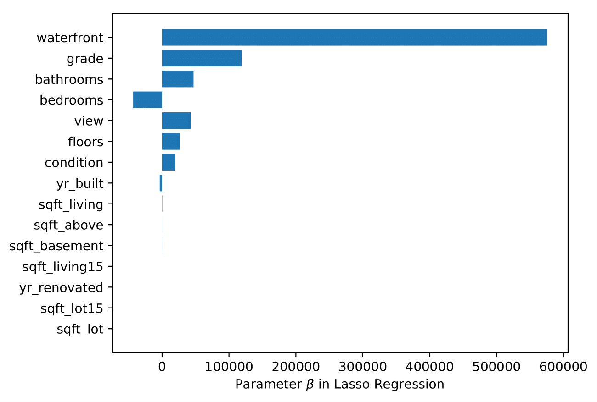
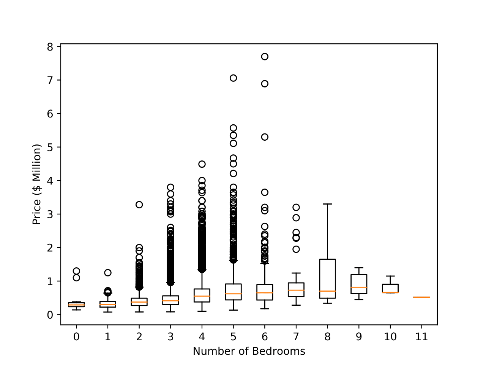

# Important Factor Analysis in House Pricing

House purchasing/selling is a very important project in everyone’s life. A deal would be made by considering many factors, such as location, quality, and space,etc. In this project, over 21613 transactions of house purchasing is investigated andreveal the importance factors of the house prices, in order. In this repo, the dataset I use is [House Sales in King County, USA](https://www.kaggle.com/harlfoxem/housesalesprediction), which contains 21613 sales transactions between May 2014 and May 2015 and each house has 19 attributes such as id, price, square feet in living room, square feet in lot, number of rooms, grades, etc. 

This project might be useful for house rental/sale companies because it can help both house sellers and buyers:
* The project is not only providing an accurate house price predictor but also analyze the latent impact factor of the price.
* For sellers, the analysis can give advices on how to improve the house quality and sale prices.
* For buyers, the project can give advice and point on what is missing in consideration of buying houses.

### Method
First, all of features in the dataset are normaized to zero mean and unit variacne. Second, a lasso-regularized linear regression is fitted with the normalized feature and the hourse prices. Mean squared error (MSE) is used as the metric and 5-fold cross-validation is employed to deterenming the regurlarization parameter. After obtaining the best peformaed regularization parameter, I train all the data in the single model with the optimal parameter. 

### Important Factors
The top-10 important features are reported in the following figure.

The most important feature is waterfront, a binary feature, indicating whether the house has a waterfront. The second important feature is the grade on internet, which is consistent with our intuition. The following features also makes sense: the number of bathrooms, the number of views online, the number of floors, year the house built and the condition score.  After the 8-th important feature, yr_built, indicating the year that house was built, the remaining parameters are almost zeros, which means these features are either not important at all or highly correlated with the top 8 features. The weird one is the number of bedrooms, intuitively, positive related to the house price, which is further analyzed in the following figure.

In the figure, the price does no always grow as the number of bedrooms increases. Surprisingly, the price and the bedroom is not always a positive relationship, especially over 6 bedrooms, more bedrooms will decrease the price. One speculation is that when a house contains fewer rooms, the buyers may need more rooms because they need more space possibly for children, parents, and guest. However, when a house alrealy has many rooms, e.g., 6, adding more bedrooms may affect the layout of the house instead of attracting more buyers.  Thus, there is a negative correaltion between number of bedrooms and the house price.

# Future Plans
1. Running my approach on a much larger dataset.
2. Using a more accurate classifier.
3. Analyzing specific groups, e.g., age, loctation, to give detailed suggestings in house buying/selling.
